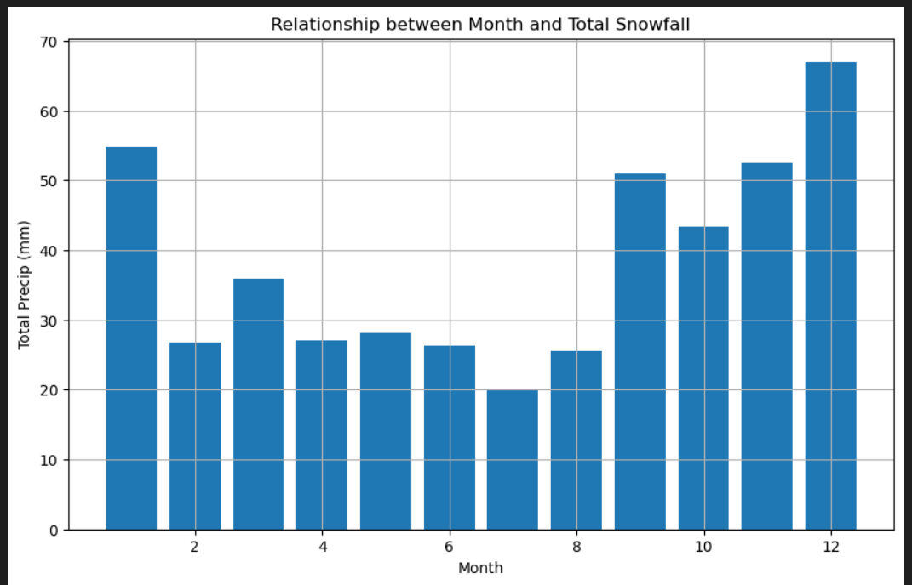
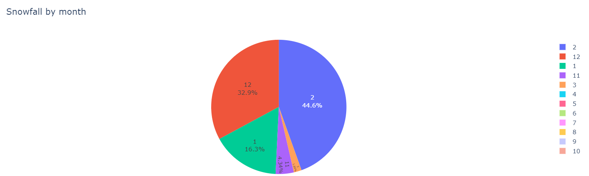

# Vancouver_Weather_Predictions

This project looks at the historical weather conditions of Vancouver city . It uses supervised learning specifically time series to predict the future weather conditions of the Vancouver.

The project considers daily historic weather data from 2014 to 2022. It considered the various peaks (highs) in temperature over the 8 year study period.

It considers several questions like what months of the year have the highest precipitation, which month of the year see the most snow and what day in particular historically has the most percipitation. The days in the months that see the most precipitation is also identified.

Although December is observed to record the lowest temperatures within the study period it did not have the highest amount of precipitation. It was observed that the month with the highest snowfall is February with December coming in at a close second and January wraping the tail of the winter months.

 

 